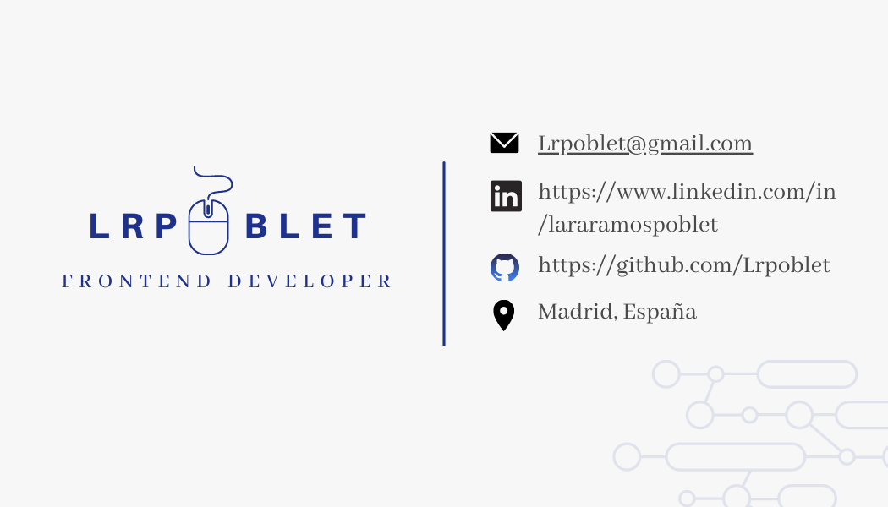

# Welcome to my GitHub page! 👋

## 👩‍💻 About me

I'm a professional in the social field in technological transformation, looking for a job opportunity as a junior web programmer. I recently graduated from the Adalab Web Programming Bootcamp, which has provided me with the following skills: HTML, CSS/SASS, JavaScript, React, NodeJS and SQL/SQLite, Agile philosophy and Scrum framework.

## ⚡Skills

Among my talents I can highlight my capacity for observation and adaptation, curiosity, the pleasure of the learning process, teamwork, decision-making (having a good global vision of the whole) and my high degree of commitment and perseverance in everything that I start. In addition, they say about me that I have great communication skills, that I have a lot of initiative and that I am very close, providing security and calm to the teams.

## 🚀 Currently

Currently I'm still training in JavaScript and React. Also, when I worked in the social sector I specialized in disability and therefore my perspective is person-centred, so I'm learning more about web accessibility to make my pages available to everyone.

## 💬 Contact

Feel free to take a look at my projects. I'm open to any type of collaboration or recommendation.

  
     

