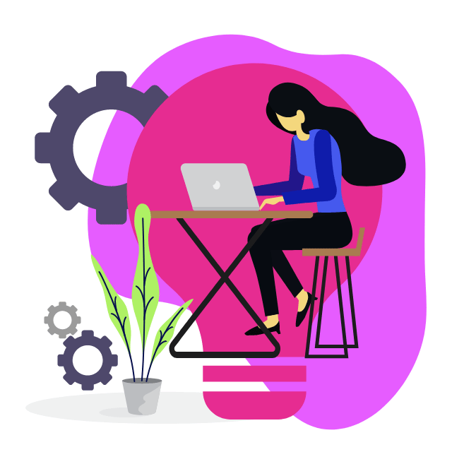

# Welcome to my GitHub page! 👋

## 👩‍💻 About me

I studied Social Work and specialized in the area of disability. My interest in technology and curiosity led me to an exciting transition to the world of web development.

Recently, I have had the opportunity to work as a Frontend Developer at Kairós DS, where I have created reusable JavaScript components with LitElement and improved the accessibility and performance of their commercial website. I have also applied tests with Jest and Cypress and worked on continuous integration and deployments with Docker, among other fundamental tasks. In addition to my experience with the aforementioned technologies, I have also worked on several projects using React as my main framework and SASS for styles.

## ⚡Skills

My adaptability, attention to detail, curiosity, and proactivity are qualities that I have developed and perfected throughout my career. Additionally, my background in social work has given me a unique and empathetic perspective on the importance of technology in society, enhancing my understanding of community needs and problem-solving.

## 🚀 Currently

My current goal is to merge my Frontend Developer skills with my experience in the disability field to create inclusive and accessible digital experiences. I firmly believe that technology can make a difference in people's lives and I am excited to be part of that change.

## 💬 Contact

Feel free to take a look at my projects. I'm open to any type of collaboration or recommendation.

  
     

